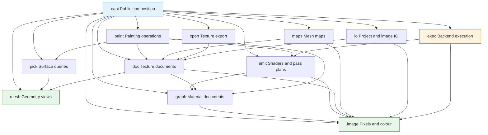

# CyberTexel

Portable, headless **C++20 3D texture-painting and PBR material-authoring
engine** — the stage that begins where `sculpt -> retopo -> UV -> bake` ends.

Paint onto a model's UV space using continuous sweeps or discrete alpha tips.
Stack layers, groups, masks and filters with twenty blend modes across extensible
channels, starting with a nine-channel PBR preset. Author materials as a node
graph that compiles to shaders, re-derive smart materials on a new model from its
mesh maps, and export channel-packed texture sets using data-driven presets.

The library **does not own a GPU device** in its primary path. It emits shaders
and an ordered pass plan, and the host runs them on its existing device. Painted
tiles stay on that device; completion records publish revisions, and explicit
asynchronous readback serves save, export and CPU access. Rust/`wgpu` desktop
apps, Swift/Metal iPad apps, Python scripts and the headless CLI all drive the
same engine through its public contract. These are specified behaviors; the
majority of the engine remains roadmap work.

**Status.** Foundation implementation. The specification lives in [`openspec/`](openspec/);
the founding change is
[`openspec/changes/bootstrap-v1-cybertexel/`](openspec/changes/bootstrap-v1-cybertexel/)
— proposal, design, twenty-four capability specs and the task plan. The strict
C++20 foundation, module gates, tiled image storage and headless colour
management are in place; remaining capabilities follow the delivery order.
`openspec/specs/` fills as the change is delivered and archived.

The first delivery slice is a working desktop and mobile painting workflow:
brush/eraser, tiled undo, save/reopen and PNG export on a real model. Resource
use and input-to-visible latency are measured before expanding the tool and
material catalogue. See [the roadmap](openspec/ROADMAP.md).

## Main features

The current implementation provides:

- Versioned [canonical stroke reconstruction](docs/stroke-reconstruction.md)
  from strictly timestamped 3D samples, with redundant-sample invariance, a
  documented fixed stabilization grid and recurrence, radius-relative spacing,
  continuous sweep links, separated discrete-alpha tip events, and independent
  pressure/tilt response curves, deterministic jitter, entry/exit taper, and
  straight-line, dominant-axis, and grid constraints, plus object-plane and
  radial symmetry within one resolved stroke. Hosts with their own stroke
  engine can ingest validated resolved stamps without reapplying modifiers;
  named [stroke presets](docs/stroke-presets.md) serialize canonically with
  explicit schema migration and future-version refusal.
- Camera-independent [texture-space paint coverage](docs/paint-coverage.md)
  with interpolated surface geometry, gap-free continuous swept capsules,
  transformed discrete tips, specified hardness falloff, and UV, squared-normal
  triplanar, or caller-framed planar material coordinates. The separate
  [paint rejection stage](docs/paint-rejection.md) provides default-on depth and
  angle tests, per-operation backface handling, explicit symmetry depth policy,
  and precision-aware alpha discard without losing accumulated strength.
  Canonical [paint deposition](docs/paint-deposition.md) separates non-building
  coverage maxima from build-up flow recurrence and is invariant to frame,
  batch, or repeated-segment rasterization. The
  [paint shading stage](docs/paint-blending.md) evaluates all twenty shared blend
  modes against an immutable stroke-start snapshot rather than partially painted
  output. Typed [paint masks](docs/paint-masking.md) intersect active-layer,
  colour-ID, geometry/polygon, screen, and UV-island restrictions before those
  canonical events enter deposition. A revision-keyed
  [paint surface-map cache](docs/paint-surface-cache.md) reuses immutable
  coverage, exact source-triangle, and UV-island maps across operations and
  invalidates them on mesh replacement or UV-set changes. Configurable
  [UV seam dilation](docs/paint-seam-dilation.md) extends directional gradients
  into texture gutters and is deferred until every dirtied tile reaches stroke
  finalization. [Seam-aware filtering](docs/seam-aware-filtering.md) consumes
  explicit surface adjacency, transforms tangent-space vectors across mirrored
  frames, and reports mip levels whose island gutters are insufficient. Isolated
  [paint preview sessions](docs/paint-preview.md) use
  copy-on-write channel storage, refuse stale commits, and publish the exact
  finalized preview—including dilation—as the committed result. The
  [bounded-work scheduler](docs/paint-bounded-work.md) expands exact stamp
  footprints by that dilation radius, processes only the resulting deduplicated
  storage tiles, and reports the full ordered tile set. Tool-level
  [Brush and Eraser](docs/brush-and-eraser.md) compose the canonical mask,
  deposition and stroke-start blending stages across enabled channels or layer
  opacity/mask values. The [Fill tool](docs/fill-tool.md) resolves whole-set,
  exact-triangle, connected-angle, UV-island, UV-tile and selection scopes from
  cached surface identities and explicit mesh adjacency. The
  [Clone tool](docs/clone-tool.md) copies an immutable source snapshot using
  aligned or fixed UV sampling and explicitly refuses cross-texture-set clones.
  [Blur and Smear](docs/blur-and-smear.md) use surface-aware sampling over an
  immutable stroke-start snapshot, including tangent-frame-correct normal maps.
  [Decal and Stencil](docs/decal-and-stencil.md) provide editable surface-frame
  material projection and transformable, invertible screen-space restrictions.
  The [Projection tool](docs/projection-tool.md) applies material images through
  a current-view camera with explicit visibility, a finite planar frame, or
  repeat-addressed normal-weighted triplanar mapping.
  The [Text tool](docs/text-tool.md) strictly decodes UTF-8, lays out supplied
  deterministic glyph coverage with tracking and line alignment, and projects
  the result as a size-aware material decal.
- Sparse tiled image storage for one-to-four-channel 8-bit, 16-bit, and
  floating-point pixels, with tile-level dirty tracking and monotonic channel
  and per-tile [content revisions](docs/host-transport-revisions.md), plus
  epoch-qualified coalesced delta queries carrying residency and generation
  metadata, explicit full-resynchronization signaling, and asynchronous named
  tile readback into caller-owned buffers with a declared direct-upload memory
  layout, host-controlled format negotiation, and budgeted copy-on-write
  snapshot tokens for consistent query-to-readback synchronization. Delta
  queries use a change-proportional revision index rather than scanning the
  document tile grid. Isolated in-flight preview resources use these same
  delta, snapshot, layout, format, and asynchronous readback contracts without
  modifying committed document pixels.
- Linear Rec. 709 and sRGB colour transforms, semantic input policies,
  preview-only 3D LUTs, ordered dithering, and promoted-precision operations.
- Memory-buffer PNG decoding and encoding with 8/16-bit preservation,
  content-based detection, metadata handling, and allocation limits.
- Extensible semantic channels and a nine-channel metallic/roughness PBR preset,
  with independent precision and allocation-free disabled channels.
- Texture-set documents derived from mesh partitions and named UVs, with stable
  identities and independent channel storage.
- Validated read-only mesh ingest and reusable flat CPU acceleration structures.
- Perspective and orthographic ray picking, ordered occlusion, configurable
  backface policy, inverse UV picking, surface snapping, region selection,
  deterministic shared-boundary ownership, and bounded cancellable batches.
- A device-independent material graph with canonical serialization, cloning,
  comparison, edit-time cycle diagnostics, typed socket coercion, and atomic
  one-link-per-input replacement. Its
  [built-in node catalogue](docs/material-node-catalogue.md) declares all input,
  texture, colour/filter, vector, and math node schemas, while reusable
  [node groups](docs/material-node-groups.md) propagate interface changes and
  refuse recursive placement. Emission-independent
  [graph validation](docs/material-graph-validation.md) reports required inputs,
  missing resources, missing groups, and unreachable nodes. Versioned
  [host node types](docs/host-node-types.md) provide checked CPU/emission
  callbacks, replay eligibility, parity fixtures, and lossless opaque fallback.
  Portable seeded-noise and shared twenty-mode blend formulas support
  conformance fixtures, while canonical [material libraries](docs/material-library.md)
  move stable, named graph presets between machines.
- An isolated [Kong shader compiler context](docs/kong-backend.md) that compiles
  Kong source deterministically to WGSL, MSL, binary SPIR-V, or HLSL, supports
  concurrent independent targets, and reports unsupported requests explicitly.
- Deterministic [material graph emission](docs/graph-emission.md) with
  node-derived result names, complete nested-group qualification, emission-time
  coercion, attribution and fan-out. Complete cached material entry points
  produce WGSL, MSL, validated SPIR-V or HLSL beside a stable pass plan.
- Validated, device-independent [pass plans](docs/pass-plans.md) with logical
  resource generations, mip/layer/tile access ranges, dependency hazards,
  derived lifetimes, explicit bindings and layouts, render state, and
  draw/dispatch commands, plus structured stable identities for host-cached
  render and compute pipelines.
- Feature-gated [layer-stack emission](docs/feature-gated-emission.md) for all
  four shader targets, with deterministic binding-budget pass splitting,
  carried intermediates, format/dimension checks, and reported float-filtering
  fallback.
- Collision-free [emission caches](docs/emission-cache.md) keyed by canonical
  graph or layer content, shader target, host-node semantics, and normalized
  device features, returning immutable identical source and pass plans on hits.
  Four-thread fixtures verify graph, target-compiler, cache, shader, and pass-plan
  results against serial emission.
- Cross-target [material preview shaders](docs/preview-shading.md) with a
  documented GGX metallic/roughness model, explicit environment and analytic
  light contracts, defined fallback lighting, and unlit inspection for every
  supplied channel.
- Instance-owned [executor discovery and selection](docs/executor-selection.md)
  with stable enumeration, runtime availability, explicit and `CTEX_EXECUTOR`
  process defaults, deterministic automatic policy, and recovery-aware fallback
  reports.
- An always-available [CPU reference executor](docs/cpu-reference-executor.md)
  with a CPU-semantics contract for every operation, homogeneous camera clipping,
  deterministic depth-tested viewport rasterization, and independent UV-space
  texel rasterization with owned depth, UV, coverage, and triangle buffers.
- [Bounded executor work](docs/execution-control.md) with cooperative
  cancellation, serialized progress, real CPU worker limits, pre-allocation
  memory admission, and commit-only-on-success staging.
- A device-free [host execution protocol](docs/host-execution.md) with explicit
  resource ownership and state, completion-token lifetime tracking, validated
  host outputs, atomic revision publication, cancellation, stale-result
  rejection, recovery-before-publication, and device-loss recovery before CPU
  fallback.
- Executor-owned [device capability reports](docs/executor-capabilities.md) for
  binding budget, texture limits and formats, float filtering, and compute,
  wired directly into layer-stack, material, and preview emission requests.
- Numeric [cross-executor parity tolerances](docs/executor-parity.md) for
  normalized 8-bit and 16-bit channels and absolute-plus-relative floating-point
  channels, with separately bounded filtered values and measured diagnostics.
- A committed document/stroke/camera/material parity corpus and CI gate that
  measures every available executor against the CPU reference and explicitly
  reports compiled but unavailable routes as unmeasured.
- An optional [owned Vulkan executor](docs/vulkan-executor.md), disabled by
  default, with pinned loader/header dependencies, deterministic physical-device
  selection, owned headless instance/device/queue lifetime, and live capability
  reporting.
- Strict C++20 builds, sanitizer coverage, OpenSpec validation, dependency
  layering checks, licence auditing, deterministic-output gates, and labeled
  [material-graph](docs/material-graph-scenarios.md),
  [shader-emission](docs/shader-emission-scenarios.md),
  [execution-backend](docs/execution-backend-scenarios.md), and
  [host-transport](docs/host-transport-scenarios.md), plus combined
  [stroke-model and paint-engine](docs/paint-scenarios.md) scenario suites.

The remaining paint tools, editable layer document, project IO, host-transport
binding/performance integrations, remaining language bindings, and complete
export workflow remain roadmap work and are not presented as implemented APIs
yet.

## Architecture

CyberTexel is split into enforced, acyclic modules. Arrows point from a consumer
to the module it depends on; only `exec` may include graphics-backend headers.



## Where it sits

| Repository | Owns |
|---|---|
| [ClayCore](https://github.com/CyberdyneCorp/ClayCore) | Form — SDF, voxel and mesh sculpting. Colour as a *field* property; explicitly not material authoring. |
| [CyberRemesherAndUV](https://github.com/CyberdyneCorp/CyberRemesherAndUV) | Topology and parameterization — quad remeshing, retopology, UVs, and **baking**. |
| **CyberTexel** | Appearance — what the surface *looks like*. Layers, materials, paint, export. |
| [ClaySpaceDesktop](https://github.com/CyberdyneCorp/ClaySpaceDesktop) | The desktop host that composes all three. |

There is **no build or link dependency** between CyberTexel and its siblings.
The seams are a format and an interface, following CyberRemesherAndUV's
`pipeline-bridge` precedent: CyberTexel defines the mesh-map set it consumes and
a provider interface; CyberRemesherAndUV implements the baking behind it.

## Planned capabilities

Twenty-four, specified before any code exists:

| | |
|---|---|
| `resource-residency` | CPU/GPU budgets, sparse residency, backing storage, eviction and mobile lifecycle recovery |
| `editable-authoring` | Replay records, checkpoints, editable paths/text/decals, resolution policies and reprojection |
| `texture-document` | Layers, groups, masks, filters, instances, channels, blend modes, tile-scoped undo with a declared budget |
| `stroke-model` | Spacing, pressure and tilt, deterministic jitter, taper, stabilizer, constraints, symmetry |
| `paint-engine` | Texture-space rasterization, swept coverage, rejection tests, coverage accumulation, seam dilation |
| `paint-tools` | Brush, Eraser, Fill, Clone, Blur, Smear, Decal, Stencil, Projection, Text, Particle, Picker, Colour ID, Selection |
| `picking` | Ray construction, the hit record every tool reads, UV-space picking, snapping, region queries |
| `material-graph` | Node document, catalogue, groups, typing and coercion, validation |
| `shader-emission` | Graph and stack to WGSL/MSL/SPIR-V/HLSL plus an ordered pass plan and declared lighting inputs |
| `execution-backends` | Host-executed, CPU reference and owned-GPU routes, with a parity gate |
| `host-transport` | Per-tile revisions, delta queries and tile readback, so a host uploads what changed |
| `mesh-and-texture-sets` | Mesh and UV ingest, UV sets, UDIM, atlases, mesh revision and replacement |
| `mesh-maps` | The map set, the bake provider interface, generators |
| `smart-materials` | Smart materials and masks, anchor points, shelves, versioned presets |
| `image-io` | Decoding and encoding, colour space on read, layered sources, hostile-input bounds |
| `color-management` | Working space, per-channel semantics, LUTs, bit-depth policy |
| `texture-export` | Channel-packing presets, formats, scopes, padding, reports |
| `project-io` | Container format, versioning, packing, autosave and recovery |
| `c-abi` | `ctex_*`, opaque handles, versioned descriptors, result codes, log sink |
| `language-bindings` | Python, Swift and Rust, held at parity with the C ABI |
| `cli-headless` | Batch binary: export, bake-request, apply, run, info, validate |
| `examples` | Python scripts that are the gallery *and* the end-to-end check |
| `device-gate` | What a performance number may claim: named devices, budgets, the scaling rule |
| `build-packaging` | Layering, licence, test, determinism and ABI gates |

## Working on it

Everything goes through [`just`](https://github.com/casey/just) — a recipe is the
single definition of its command, and CI invokes the same recipes a contributor
runs.

```
just              # list every recipe
just check-spec   # specification checks; needs no build
just check        # everything that needs no device
just build test examples
```

`just build` uses the native `headless` CMake preset. Shipped build presets also
cover `linux-x64`, `macos-universal`, `windows-x64`, `ios-arm64` and
`android-arm64`; the Android preset reads `ANDROID_NDK_HOME`.

The current library and binding version is defined only in [`VERSION`](VERSION).
The version gate checks CMake, the C ABI, the future container writer and the
Python, Swift and Rust manifests for drift.

Gates whose implementing task is not yet done exit non-zero and name that task,
so `just check` cannot pass vacuously. See [CONTRIBUTING.md](CONTRIBUTING.md).

## Prior art

Two products define the problem, and one of them we may read.

**Substance Painter** (Adobe, closed) is the behavioural reference for texture
sets, mesh maps, smart materials, smart masks, anchor points and channel-packing
export presets. Public documentation only — no code, no assets, no format.

**[ArmorPaint](https://github.com/armory3d/armorpaint)** (zlib) is a working,
permissively licensed implementation of the hard half, and its behaviour is
specified in full at
`openspec/specs/` in that project. CyberTexel takes its architecture directly:
UV-as-clip-space rasterization so one fragment is one texel; a swept capsule
instead of dab spacing; blending against a stroke-start snapshot so every blend
mode works while painting; a per-stroke coverage mask so self-overlap does not
darken; extrapolating seam dilation; and a node graph that emits shader text.
Its **Kong** compiler (zlib) already targets WGSL — the language `wgpu` hosts
speak and the one ClayCore's own dialect does not reach.

Where CyberTexel deliberately diverges: **tile-scoped undo** with a declared
memory budget rather than a ring of whole-texture snapshots that silently
collapses to one step at 16K; **texture sets** as the binding unit rather than
per-layer object masks; **edit-time cycle detection** in the graph rather than a
forward reference that fails at shader-compile time; and **no owned renderer**.

## Licence

MIT. See [LICENSE](LICENSE). Third-party components are permissively licensed
and recorded in the attribution file; the dependency audit is a release gate.
