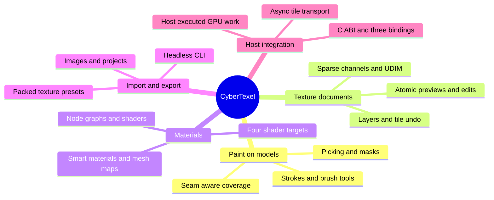
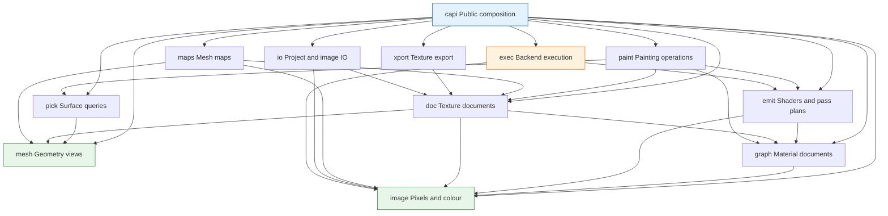

# CyberTexel

Portable, headless **C++20 3D texture-painting and PBR material-authoring
engine** — the stage that begins where `sculpt -> retopo -> UV -> bake` ends.

Paint onto a model's UV space using continuous sweeps or discrete alpha tips.
Stack layers, groups, masks and filters with twenty blend modes across extensible
channels, starting with a nine-channel PBR preset. Author materials as a node
graph that compiles to shaders, re-derive smart materials on a new model from its
mesh maps, and export channel-packed texture sets using data-driven presets.

The library **does not own a GPU device** in its primary path. It emits shaders
and an ordered pass plan, and the host runs them on its existing device. The
[reference hosts](hosts/) do exactly that over `wgpu` and Metal. Painted
tiles stay on that device; completion records publish revisions, and explicit
asynchronous readback serves save, export and CPU access. Rust/`wgpu` desktop
apps, Swift/Metal iPad apps, Python scripts and the headless CLI all drive the
same engine through its public contract.

## Status

All twenty-four capabilities are implemented and reachable through the stable
C ABI and the Python, Swift and Rust bindings. Numbered Python examples
exercise all 354 public C ABI operations, proven by recorded call traces
rather than declared. The specification lives in
[`openspec/`](openspec/); the founding change is
[`openspec/changes/archive/2026-09-24-bootstrap-v1-cybertexel/`](openspec/changes/archive/2026-09-24-bootstrap-v1-cybertexel/)
— proposal, design, twenty-four capability specs and the task plan, whose
checkboxes record its completion. The current requirements live in
[`openspec/specs/`](openspec/specs/).

The [initial `v0.1.0` GitHub release](https://github.com/CyberdyneCorp/CyberTexel/releases/tag/v0.1.0)
ships validated Linux x64, macOS universal and iOS arm64 packages. Its tag
points to a commit with green main CI and named Mac/iPad device gates.

Current status and open work:

| | |
|---|---|
| **Reference hosts** | [Both hosts](hosts/) execute an emitted pass plan on a real device API. The [reference-device workflow](docs/reference-device-ci.md) passed on the named M3 Pro and physical iPad Air M3 for the release commit. |
| **Performance numbers** | Sixteen of thirty budgets are decided on their named devices and fifteen pass. The release device gate measured input-to-visible medians of 10.49 ms on the M3 Pro and 20.43 ms on the iPad Air M3, against refresh-derived ceilings of 16 and 32 ms. The twenty-minute tablet workload held its final-window p95 at 20.62 ms against 33 ms and peaked at about 181 MB against 512 MB. The position-gradient generator is the one failure, at 2 248 ms against a 100 ms ceiling; removing redundant per-texel work took it down from 4 855 ms, and threading and SIMD would close the rest. `just gate-budgets` reports absent hardware as unmeasured, never as a pass. |
| **Platform packages** | macOS, Linux and iPad build, smoke-test and archive (`just gate-packages`). Windows and Android packaging and release validation are tracked in the active [`windows-android-release`](openspec/changes/windows-android-release/) change. |

No claim about mobile responsiveness, memory efficiency or device parity is
satisfied by a headless CPU test, and the gates are written so that one cannot
stand in for the other. Latency ceilings are derived from each reference
device's refresh rate rather than hand-written, because a frame cannot be
visible before the next vsync: the desktop's ceilings fix the accepted pipeline
depth in refresh periods, and every other device's follow from its own panel.
See [the roadmap](openspec/ROADMAP.md).

## Main features



See the [complete feature description](docs/main-features.md) for the tool,
storage, material, execution, and format details.

## Architecture

CyberTexel is split into enforced, acyclic modules. Arrows point from a consumer
to the module it depends on; only `exec` may include graphics-backend headers.



## Where it sits

| Repository | Owns |
|---|---|
| [ClayCore](https://github.com/CyberdyneCorp/ClayCore) | Form — SDF, voxel and mesh sculpting. Colour as a *field* property; explicitly not material authoring. |
| [CyberRemesherAndUV](https://github.com/CyberdyneCorp/CyberRemesherAndUV) | Topology and parameterization — quad remeshing, retopology, UVs, and **baking**. |
| **CyberTexel** | Appearance — what the surface *looks like*. Layers, materials, paint, export. |
| [ClaySpaceDesktop](https://github.com/CyberdyneCorp/ClaySpaceDesktop) | The desktop host that composes all three. |

There is **no build or link dependency** between CyberTexel and its siblings.
The seams are a format and an interface, following CyberRemesherAndUV's
`pipeline-bridge` precedent: CyberTexel defines the mesh-map set it consumes and
a provider interface; CyberRemesherAndUV implements the baking behind it.
The opt-in [provider example](examples/cyber_remesher_and_uv/README.md) shows
that integration against the sibling's stable C ABI without changing the
default dependency graph.

## Capabilities

Twenty-four, each specified before it was written and each mapped to executable
evidence:

| | |
|---|---|
| `resource-residency` | CPU/GPU budgets, sparse residency, backing storage, eviction and mobile lifecycle recovery |
| `editable-authoring` | Replay records, checkpoints, editable paths/text/decals, resolution policies and reprojection |
| `texture-document` | Layers, groups, masks, filters, instances, channels, blend modes, tile-scoped undo with a declared budget |
| `stroke-model` | Spacing, pressure and tilt, deterministic jitter, taper, stabilizer, constraints, symmetry |
| `paint-engine` | Texture-space rasterization, swept coverage, rejection tests, coverage accumulation, seam dilation |
| `paint-tools` | Brush, Eraser, Fill, Clone, Blur, Smear, Decal, Stencil, Projection, Text, Particle, Picker, Colour ID, Selection |
| `picking` | Ray construction, the hit record every tool reads, UV-space picking, snapping, region queries |
| `material-graph` | Node document, catalogue, groups, typing and coercion, validation |
| `shader-emission` | Graph and stack to WGSL/MSL/SPIR-V/HLSL plus an ordered pass plan and declared lighting inputs |
| `execution-backends` | Host-executed, CPU reference and owned-GPU routes, with a parity gate |
| `host-transport` | Per-tile revisions, delta queries and tile readback, so a host uploads what changed |
| `mesh-and-texture-sets` | Mesh and UV ingest, UV sets, UDIM, atlases, mesh revision and replacement |
| `mesh-maps` | The map set, the bake provider interface, generators |
| `smart-materials` | Smart materials and masks, anchor points, shelves, versioned presets |
| `image-io` | Decoding and encoding, colour space on read, layered sources, hostile-input bounds |
| `color-management` | Working space, per-channel semantics, LUTs, bit-depth policy |
| `texture-export` | Channel-packing presets, formats, scopes, padding, reports |
| `project-io` | Container format, versioning, packing, autosave and recovery |
| `c-abi` | `ctex_*`, opaque handles, versioned descriptors, result codes, log sink |
| `language-bindings` | Python, Swift and Rust, held at parity with the C ABI |
| `cli-headless` | Batch binary: export, bake-request, apply, run, info, validate |
| `examples` | Python scripts that are the gallery *and* the end-to-end check |
| `device-gate` | What a performance number may claim: named devices, budgets, the scaling rule |
| `build-packaging` | Layering, licence, test, determinism and ABI gates |

## Working on it

Everything goes through [`just`](https://github.com/casey/just) — a recipe is the
single definition of its command, and CI invokes the same recipes a contributor
runs.

```
just              # list every recipe
just check-spec   # specification checks; needs no build
just check        # everything that needs no device
just build test examples
```

The installed-wheel [Python examples](docs/examples.md) and their
[committed gallery](docs/gallery.md) use provenance-recorded fixtures and
compare generated artifacts with committed outputs. `just examples` records
which C ABI symbols each example actually called and decides that trace against
the capability manifest, so
[which features the examples exercise](docs/examples-scenarios.md#feature-coverage)
is measured rather than declared.

The native build also produces the [headless `cybertexel` command line](docs/headless-cli.md):
`export`, `bake-request`, `apply`, `run`, `info` and `validate`, each with
distinct exit codes, machine-readable reports, executor selection, budget flags
and interrupt handling that leaves no partial file. The CLI target is
desktop-only; mobile presets install the library and bindings without trying to
package an executable bundle.

`just build` uses the native `headless` CMake preset, which is a debug build.
Shipped build presets cover `linux-x64`, `macos-universal`, `windows-x64`,
`ios-arm64` and `android-arm64`; the Android preset reads `ANDROID_NDK_HOME`.
`just gate-packages` decides the platforms
[`release/platforms.json`](release/platforms.json) declares in scope and reports
the deferred ones by name, and `just gate-reproducible` builds the shipped
preset twice and compares the libraries byte for byte against
[the documented variances](docs/reproducible-builds.md).

The current library and binding version is defined only in [`VERSION`](VERSION).
The version gate checks CMake, the C ABI, the future container writer and the
Python, Swift and Rust manifests for drift.

Gates whose implementing task is not yet done exit non-zero and name that task,
so `just check` cannot pass vacuously. See [CONTRIBUTING.md](CONTRIBUTING.md).

## Prior art

[Adobe Substance 3D Painter](https://www.adobe.com/products/substance3d/features.html)
and [ArmorPaint](https://armorpaint.org/manual) are complete painting applications
with viewports. CyberTexel provides painting and material-authoring operations
for a host application to present and execute. Their documented workflows
provide the comparison points:

| Feature | Substance 3D Painter | ArmorPaint | CyberTexel |
|---|---|---|---|
| Surface authoring | [Texture-set layer stacks](https://experienceleague.adobe.com/en/docs/substance-3d-painter/using/interface/layer-stack/layer-stack), masks, [smart materials](https://experienceleague.adobe.com/en/docs/substance-3d-painter/using/features/smart-materials-and-masks), and [anchor points](https://experienceleague.adobe.com/en/docs/substance-3d-painter/using/effects/anchor-point) | Paint, fill, mask, filter, group, path, and decal layers; node-based materials and brushes | Texture sets, layers, masks, editable tools, material graphs, smart materials, and anchors through the public API |
| Mesh maps | [Built-in baking mode](https://experienceleague.adobe.com/en/docs/substance-3d-painter/using/baking/baking) | Built-in bake nodes | Consumes mesh maps through a host-supplied bake provider; includes mask generators |
| Texture export | [Output templates](https://experienceleague.adobe.com/en/docs/substance-3d-painter/using/export/export) select names, channel packing, formats, and bit depths | Custom channel-swizzle presets, UV padding, and atlas output | Data-only packing presets, UDIM and atlas scopes, padding, and headless export |
| Integration | Desktop application with a Python scripting API | Stand-alone application with plugins and command-line actions | Headless C++20 library with a C ABI, Python, Swift, and Rust bindings; the host runs GPU work |

ArmorPaint's [public implementation](https://github.com/armory3d/armorpaint)
informed CyberTexel's texture-space paint path, stroke-start blending,
coverage masks, seam dilation, and Kong shader emission. CyberTexel makes
different integration choices: host-owned GPU execution, explicit tile
transport, and tile-scoped undo under a declared memory budget. Painter's
documented authoring workflows informed the texture-set and preset contracts;
CyberTexel does not provide Painter's editor or built-in baking mode.

## Licence

MIT. See [LICENSE](LICENSE). Third-party components are permissively licensed
and recorded in the attribution file; the dependency audit is a release gate.
