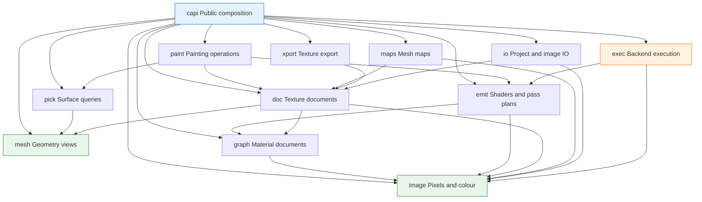

# CyberTexel

Portable, headless **C++20 3D texture-painting and PBR material-authoring
engine** — the stage that begins where `sculpt -> retopo -> UV -> bake` ends.

Paint onto a model's UV space using continuous sweeps or discrete alpha tips.
Stack layers, groups, masks and filters with twenty blend modes across extensible
channels, starting with a nine-channel PBR preset. Author materials as a node
graph that compiles to shaders, re-derive smart materials on a new model from its
mesh maps, and export channel-packed texture sets using data-driven presets.

The library **does not own a GPU device** in its primary path. It emits shaders
and an ordered pass plan, and the host runs them on its existing device. Painted
tiles stay on that device; completion records publish revisions, and explicit
asynchronous readback serves save, export and CPU access. Rust/`wgpu` desktop
apps, Swift/Metal iPad apps, Python scripts and the headless CLI all drive the
same engine through its public contract. These are specified behaviors; the
majority of the engine remains roadmap work.

**Status.** Foundation implementation. The specification lives in [`openspec/`](openspec/);
the founding change is
[`openspec/changes/bootstrap-v1-cybertexel/`](openspec/changes/bootstrap-v1-cybertexel/)
— proposal, design, twenty-four capability specs and the task plan. The strict
C++20 foundation, module gates, tiled image storage and headless colour
management are in place; remaining capabilities follow the delivery order.
`openspec/specs/` fills as the change is delivered and archived.

The first delivery slice is a working desktop and mobile painting workflow:
brush/eraser, tiled undo, save/reopen and PNG export on a real model. Resource
use and input-to-visible latency are measured before expanding the tool and
material catalogue. See [the roadmap](openspec/ROADMAP.md).

## Main features

The current implementation provides:

- Sparse tiled image storage for one-to-four-channel 8-bit, 16-bit, and
  floating-point pixels, with tile-level dirty tracking.
- Linear Rec. 709 and sRGB colour transforms, semantic input policies,
  preview-only 3D LUTs, ordered dithering, and promoted-precision operations.
- Memory-buffer PNG decoding and encoding with 8/16-bit preservation,
  content-based detection, metadata handling, and allocation limits.
- Extensible semantic channels and a nine-channel metallic/roughness PBR preset,
  with independent precision and allocation-free disabled channels.
- Texture-set documents derived from mesh partitions and named UVs, with stable
  identities and independent channel storage.
- Validated read-only mesh ingest and reusable flat CPU acceleration structures.
- Perspective and orthographic ray picking, ordered occlusion, configurable
  backface policy, inverse UV picking, surface snapping, region selection,
  deterministic shared-boundary ownership, and bounded cancellable batches.
- A device-independent material graph with canonical serialization, cloning,
  comparison, edit-time cycle diagnostics, typed socket coercion, and atomic
  one-link-per-input replacement. Its
  [built-in node catalogue](docs/material-node-catalogue.md) declares all input,
  texture, colour/filter, vector, and math node schemas.
- Strict C++20 builds, sanitizer coverage, OpenSpec validation, dependency
  layering checks, licence auditing, and deterministic-output gates.

The layer stack, painting engine, shader emission, host transport, project IO,
bindings, and complete export workflow remain roadmap work and are not presented
as implemented APIs yet.

## Architecture

CyberTexel is split into enforced, acyclic modules. Arrows point from a consumer
to the module it depends on; only `exec` may include graphics-backend headers.



## Where it sits

| Repository | Owns |
|---|---|
| [ClayCore](https://github.com/CyberdyneCorp/ClayCore) | Form — SDF, voxel and mesh sculpting. Colour as a *field* property; explicitly not material authoring. |
| [CyberRemesherAndUV](https://github.com/CyberdyneCorp/CyberRemesherAndUV) | Topology and parameterization — quad remeshing, retopology, UVs, and **baking**. |
| **CyberTexel** | Appearance — what the surface *looks like*. Layers, materials, paint, export. |
| [ClaySpaceDesktop](https://github.com/CyberdyneCorp/ClaySpaceDesktop) | The desktop host that composes all three. |

There is **no build or link dependency** between CyberTexel and its siblings.
The seams are a format and an interface, following CyberRemesherAndUV's
`pipeline-bridge` precedent: CyberTexel defines the mesh-map set it consumes and
a provider interface; CyberRemesherAndUV implements the baking behind it.

## Planned capabilities

Twenty-four, specified before any code exists:

| | |
|---|---|
| `resource-residency` | CPU/GPU budgets, sparse residency, backing storage, eviction and mobile lifecycle recovery |
| `editable-authoring` | Replay records, checkpoints, editable paths/text/decals, resolution policies and reprojection |
| `texture-document` | Layers, groups, masks, filters, instances, channels, blend modes, tile-scoped undo with a declared budget |
| `stroke-model` | Spacing, pressure and tilt, deterministic jitter, taper, stabilizer, constraints, symmetry |
| `paint-engine` | Texture-space rasterization, swept coverage, rejection tests, coverage accumulation, seam dilation |
| `paint-tools` | Brush, Eraser, Fill, Clone, Blur, Smear, Decal, Stencil, Projection, Text, Particle, Picker, Colour ID, Selection |
| `picking` | Ray construction, the hit record every tool reads, UV-space picking, snapping, region queries |
| `material-graph` | Node document, catalogue, groups, typing and coercion, validation |
| `shader-emission` | Graph and stack to WGSL/MSL/SPIR-V/HLSL plus an ordered pass plan and declared lighting inputs |
| `execution-backends` | Host-executed, CPU reference and owned-GPU routes, with a parity gate |
| `host-transport` | Per-tile revisions, delta queries and tile readback, so a host uploads what changed |
| `mesh-and-texture-sets` | Mesh and UV ingest, UV sets, UDIM, atlases, mesh revision and replacement |
| `mesh-maps` | The map set, the bake provider interface, generators |
| `smart-materials` | Smart materials and masks, anchor points, shelves, versioned presets |
| `image-io` | Decoding and encoding, colour space on read, layered sources, hostile-input bounds |
| `color-management` | Working space, per-channel semantics, LUTs, bit-depth policy |
| `texture-export` | Channel-packing presets, formats, scopes, padding, reports |
| `project-io` | Container format, versioning, packing, autosave and recovery |
| `c-abi` | `ctex_*`, opaque handles, versioned descriptors, result codes, log sink |
| `language-bindings` | Python, Swift and Rust, held at parity with the C ABI |
| `cli-headless` | Batch binary: export, bake-request, apply, run, info, validate |
| `examples` | Python scripts that are the gallery *and* the end-to-end check |
| `device-gate` | What a performance number may claim: named devices, budgets, the scaling rule |
| `build-packaging` | Layering, licence, test, determinism and ABI gates |

## Working on it

Everything goes through [`just`](https://github.com/casey/just) — a recipe is the
single definition of its command, and CI invokes the same recipes a contributor
runs.

```
just              # list every recipe
just check-spec   # specification checks; needs no build
just check        # everything that needs no device
just build test examples
```

`just build` uses the native `headless` CMake preset. Shipped build presets also
cover `linux-x64`, `macos-universal`, `windows-x64`, `ios-arm64` and
`android-arm64`; the Android preset reads `ANDROID_NDK_HOME`.

The current library and binding version is defined only in [`VERSION`](VERSION).
The version gate checks CMake, the C ABI, the future container writer and the
Python, Swift and Rust manifests for drift.

Gates whose implementing task is not yet done exit non-zero and name that task,
so `just check` cannot pass vacuously. See [CONTRIBUTING.md](CONTRIBUTING.md).

## Prior art

Two products define the problem, and one of them we may read.

**Substance Painter** (Adobe, closed) is the behavioural reference for texture
sets, mesh maps, smart materials, smart masks, anchor points and channel-packing
export presets. Public documentation only — no code, no assets, no format.

**[ArmorPaint](https://github.com/armory3d/armorpaint)** (zlib) is a working,
permissively licensed implementation of the hard half, and its behaviour is
specified in full at
`openspec/specs/` in that project. CyberTexel takes its architecture directly:
UV-as-clip-space rasterization so one fragment is one texel; a swept capsule
instead of dab spacing; blending against a stroke-start snapshot so every blend
mode works while painting; a per-stroke coverage mask so self-overlap does not
darken; extrapolating seam dilation; and a node graph that emits shader text.
Its **Kong** compiler (zlib) already targets WGSL — the language `wgpu` hosts
speak and the one ClayCore's own dialect does not reach.

Where CyberTexel deliberately diverges: **tile-scoped undo** with a declared
memory budget rather than a ring of whole-texture snapshots that silently
collapses to one step at 16K; **texture sets** as the binding unit rather than
per-layer object masks; **edit-time cycle detection** in the graph rather than a
forward reference that fails at shader-compile time; and **no owned renderer**.

## Licence

MIT. See [LICENSE](LICENSE). Third-party components are permissively licensed
and recorded in the attribution file; the dependency audit is a release gate.
