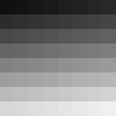
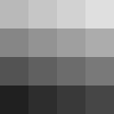
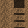

# CyberTexel example gallery

These artifacts are produced by the numbered Python examples and compared with
the committed references by `just examples`. Binary and report outputs require
an exact byte match. PNG previews are compared as decoded pixels using the
maximum absolute channel error declared in `examples/output_tolerances.json`.

## `01_version_and_project_container`

Creates a canonical empty `.ctex` project through the generated Python C ABI.
It covers `build-packaging`, `c-abi`, `examples`, `language-bindings` and
`project-io` and publishes the
[empty project](../examples/outputs/01_version_and_project_container/empty.ctex)
and its
[container summary](../examples/outputs/01_version_and_project_container/summary.json).

## `02_image_io`

Decodes the checked-in color fixture, asserts named pixels and channel means,
enlarges it with NumPy, then encodes and decodes the preview through CyberTexel.
It covers `image-io` and `language-bindings`. Its declared pixel tolerance is
zero.

The machine-readable [image summary](../examples/outputs/02_image_io/summary.json)
records the source and preview shapes and asserted channel means.

## `03_mesh_map_generator`

Loads the checked UV quad into a texture document, imports the ambient-occlusion
fixture as a mesh map and evaluates the built-in mask generator at the texture
set resolution. It covers `mesh-and-texture-sets`, `mesh-maps` and
`texture-document`.

The [generator summary](../examples/outputs/03_mesh_map_generator/summary.json)
records mesh counts, source/output resolutions and asserted mask statistics.

## `04_software_host_execution`

Emits a real WGSL material and pass plan, validates the render target and draw
contract, executes the constant material with a display-free software stand-in,
then publishes the host-resident generation with recovery evidence and no pixel
readback. It covers `execution-backends`, `host-transport`, `material-graph`,
`resource-residency` and `shader-emission`.

The committed [pass plan](../examples/outputs/04_software_host_execution/pass_plan.json)
and [execution summary](../examples/outputs/04_software_host_execution/summary.json)
make the resource contract and residency result inspectable.

## `05_color_management`

Queries the working space and normal-channel precision policy, converts a full
sRGB ramp to linear Rec. 709, accumulates height before quantization and renders
the deterministic ordered-dither pattern. It covers `color-management`.

The [colour summary](../examples/outputs/05_color_management/summary.json)
records the reference midpoint, precision recommendation and quantized values.

## `06_uv_picking`

Builds the deterministic UV acceleration index, queries one hit on each quad
triangle, asserts interpolated positions and barycentrics, and verifies that an
outside coordinate is a distinct miss. It covers `picking`.

The [picking summary](../examples/outputs/06_uv_picking/summary.json) records the
resolved texture-set identity, triangle indices and world positions.

## `07_editable_operation_record`

Creates a resolution-independent brush operation with a deterministic seed,
pinned brush-alpha bytes and channel metadata, inserts it into a canonical
project, extracts it and requires byte-identical recovery. It covers
`editable-authoring`. Checkpoint-bearing records additionally require their
named tiled image to exist in the project, as enforced by the native API.

The gallery retains the canonical [operation record](../examples/outputs/07_editable_operation_record/stroke.operation),
[project container](../examples/outputs/07_editable_operation_record/editable.ctex),
[record inventory](../examples/outputs/07_editable_operation_record/record_report.json),
[project inventory](../examples/outputs/07_editable_operation_record/project_report.json)
and [round-trip summary](../examples/outputs/07_editable_operation_record/summary.json).

## `08_brush_stroke`

Resolves three timestamped surface samples into a continuous swept stroke,
rasterizes its geometric coverage and non-building deposition, then applies an
orange base-colour material to the stroke-start snapshot through the atomic
brush tool. It covers `stroke-model`, `paint-engine` and `paint-tools`.

The [paint summary](../examples/outputs/08_brush_stroke/summary.json) records the
resolved stamp and segment counts together with coverage and write statistics.

## `09_end_to_end_material_export`

Carries the UV fixture and its ambient-occlusion map through a texture set and
generated mask, embeds a canonical material graph in a smart material, applies
the material as a document layer, and exports the shaded base colour through the
native texture-export pipeline. It covers `smart-materials` and `texture-export`
and is the worked end-to-end pipeline example.

The [pipeline summary](../examples/outputs/09_end_to_end_material_export/summary.json)
records the material application, model size, generated filename and decoded
output shape.

## `10_headless_script_pipeline`

Creates a small project, invokes the installed wheel's isolated headless script
runner, verifies that script output is diagnostic-only, and reopens the result
to prove the roughness-channel edit persisted. It covers `cli-headless`.

The gallery retains the edited [project container](../examples/outputs/10_headless_script_pipeline/scripted.ctex)
and the checked [headless summary](../examples/outputs/10_headless_script_pipeline/summary.json).

## `11_device_gate_policy`

Exercises the `device-gate` decision vocabulary with deterministic policy
fixtures: a named reference result may pass or fail, while an unnamed machine,
an absent device and a value below the absolute floor remain informational,
unmeasured and unreachable. It explicitly makes no hardware performance claim.

The [policy summary](../examples/outputs/11_device_gate_policy/summary.json)
records all five asserted decisions and the native version used.

## `12_host_transport_readback`

Paints two texels, asks what changed since a revision cursor, pins the answer as
a budgeted snapshot, reads the tile memory layout the host must upload into, and
completes an asynchronous readback with exactly those tile payloads. A pending
readback publishes nothing, and an unknown channel raises a typed exception
carrying the native diagnostic code. It covers `host-transport`, `paint-engine`,
`texture-document` and `c-abi`, and needs no device.

The [transport summary](../examples/outputs/12_host_transport_readback/host_transport.json)
records both revision cursors, the tile count and byte sizes, the refused
pending readback and the diagnostic code.

## `13_layer_stack`

Registers a custom channel semantic through the same descriptor the built-in PBR
preset uses, appends a group, a nested paint entry and an attached mask as one
atomically validated batch, proves that an entry naming an absent parent leaves
the stack revision unchanged, then edits and removes entries. It covers
`texture-document`.

The [stack summary](../examples/outputs/13_layer_stack/layer_stack.json) records
the resolved channels, the entries before and after removal, the refused batch
and the edited blend mode.

## `14_udim_and_atlases`

Declares sparse UDIM tiles, writes texels addressed in absolute UV so one batch
crosses a tile border, reads them back by checked tile number, shows that an
undeclared tile reads the channel default without becoming occupied, then groups
two texture sets into a validated atlas and proves overlapping regions are
refused. It covers `mesh-and-texture-sets`.

The [UDIM and atlas summary](../examples/outputs/14_udim_and_atlases/udim_and_atlases.json)
records the occupied tiles, the write report, both recovered texels and the
atlas extent.

## `15_masked_panel_selection_fill`

Decide what is paintable on a two-island panel, then fill, blend and erase it. A trim pass on a hull panel: cache the surface map for one tile, read the channels under the cursor, narrow the paintable area with colour-ID, screen, polygon and stencil masks, intersect every mask class, then plan the tiles, fill, blend, erase and dilate the result across the island gutter. It covers `paint-engine`, `paint-tools`.

The gallery retains [`summary.json`](../examples/outputs/15_masked_panel_selection_fill/summary.json).

## `16_badge_stamping_and_seam_healing`

Stamp a badge onto a crate panel with the retained tools, then heal its seams. The badge pass end to end: restore the saved preset against the published catalogue, stamp a decal and a text label, project, spray, filter, pad, defer a dilation session and report what a cancelled preview leaves behind. It covers `paint-tools`, `paint-engine`, `stroke-model`.

The gallery retains [`summary.json`](../examples/outputs/16_badge_stamping_and_seam_healing/summary.json).

## `17_material_graph_authoring`

Author a material graph, publish it, and share a node group across a workspace. The example browses the built-in node catalogue, grows the default document into a copper material, validates it against the resources a project owns, stores it under a stable library identity, and propagates one reusable node group to every material in a workspace without losing the values each instance already carried. It covers `material-graph`.

The gallery retains [`copper_graph.json`](../examples/outputs/17_material_graph_authoring/copper_graph.json), [`summary.json`](../examples/outputs/17_material_graph_authoring/summary.json).

## `18_shader_emission_pipeline`

Register a host node type and emit every shader a viewport needs from it. The example teaches the graph a studio node type, holds it to the reference contract that proves its CPU and emission paths agree, places it in a material, then emits that material, a layer-stack composite and the lit preview for the declared targets, reusing one emission cache and reading the pass plan back. It covers `material-graph`, `shader-emission`.

The gallery retains [`summary.json`](../examples/outputs/18_shader_emission_pipeline/summary.json).

## `19_mesh_uv_audit_and_retopology`

Audit a scan's UV sets, derive texture sets from it and stage a retopology. A scanned mesh arrives with two UV sets: the raw ``scan`` layout the scanner produced and a hand-packed ``packed`` layout. The example measures both, derives one texture set per mesh partition from the layout that survived the audit, packs those sets into an atlas, picks it back by face material, and stages a retopologised replacement that carries a declared tangent frame, so every affected texture set gets an explicit policy before any mesh is published. It covers `mesh-and-texture-sets`.

The gallery retains [`summary.json`](../examples/outputs/19_mesh_uv_audit_and_retopology/summary.json).

## `20_layer_gesture_and_undo`

Composite a masked layer group, then edit it as one undoable gesture. The example builds a masked group, asks what participates in a channel and composites it from caller-owned rasters and from an owned snapshot. A bare tile-history capture retains nothing for a layer-stack edit, while a transaction mixing pixel writes with stack edits commits, undoes and redoes as one step. It covers `texture-document`.

The gallery retains [`summary.json`](../examples/outputs/20_layer_gesture_and_undo/summary.json).

## `21_smart_material_authoring`

Author a parameterised, anchored smart material and apply it to a texture set. One exposed parameter drives the same graph input in two differently authored stack entries, an anchor publishes the base layer into the coat, and the finished material is applied, masked, edited and undone on a texture set. It covers `smart-materials`.

The gallery retains [`applications.json`](../examples/outputs/21_smart_material_authoring/applications.json), [`atelier_copper.smart-material`](../examples/outputs/21_smart_material_authoring/atelier_copper.smart-material), [`atelier_grime.smart-mask`](../examples/outputs/21_smart_material_authoring/atelier_grime.smart-mask), [`summary.json`](../examples/outputs/21_smart_material_authoring/summary.json).

## `22_project_publish_and_recover`

Publish a smart material into a project library, then recover it after a lost session. The material is packaged with its image resource and imported back packed, referenced and missing; the library it is installed into is normalized, saved atomically, autosaved, enumerated from the recovery directory and resumed, and a published texture-export preset plans the delivery maps it would write. It covers `project-io`, `smart-materials`, `texture-export`.

The gallery retains [`foundry_brass.ctex-asset`](../examples/outputs/22_project_publish_and_recover/foundry_brass.ctex-asset), [`foundry_library.ctex`](../examples/outputs/22_project_publish_and_recover/foundry_library.ctex), [`recovered_project.json`](../examples/outputs/22_project_publish_and_recover/recovered_project.json), [`summary.json`](../examples/outputs/22_project_publish_and_recover/summary.json).

## `23_viewport_picking_survey`

Answer every viewport picking question about a two-panel prop from one index. A front panel and a back panel share the same UV square. The script builds one acceleration structure over both and asks it what is under the cursor, what is behind that, what a snapped point lands on, what a rubber band encloses, and what a whole grid of rays reached, then asks the same question in UV space. The grid answer is published through the raw image expansion and resampling calls. It covers `picking`, `image-io`.

The gallery retains [`pick_coverage.png`](../examples/outputs/23_viewport_picking_survey/pick_coverage.png), [`summary.json`](../examples/outputs/23_viewport_picking_survey/summary.json).

## `24_mesh_map_delivery`

Turn a delivered layered PSD into a bound, colour-managed mesh-map set. A vendor delivers baked maps as one layered PSD. The script splits the layers, resolves what colour space each delivered channel meant, binds scalar maps to a texture set, proves a missing map is named rather than guessed, generates a wear mask, re-bakes one map through versioned tokens, and releases what it made resident. It covers `mesh-maps`, `image-io`, `color-management`.

The gallery retains [`summary.json`](../examples/outputs/24_mesh_map_delivery/summary.json), [`wear_mask.png`](../examples/outputs/24_mesh_map_delivery/wear_mask.png).

## `25_executor_routes_and_parity`

Pick an executor route, survive a device loss, and gate CPU/host parity. A host enumerates the routes it was compiled with, asks for one by name, and pins a process default. Its GPU then disappears mid-frame: the session publishes what a checkpoint can restore, cancels what cannot finish, names every resource the host must recreate, and only with recovery restored authorises the CPU fallback. That route rasterizes a camera view and a UV tile and runs staged work under a memory ceiling it refuses to exceed; the parity gate then proves the two routes agree inside the declared tolerance. It covers `execution-backends`, `host-transport`.

The gallery retains [`device_loss_fallback.json`](../examples/outputs/25_executor_routes_and_parity/device_loss_fallback.json).

## `26_budgeted_residency_and_upload`

Account every resident byte, then upload only the tiles a host has not seen. A host owns the allocator and the log sink, so every byte and every refusal is its own. It records what it holds in the resource ledger, which admits large work as bounded tile batches, evicts cache before breaking a limit, and degrades preview quality rather than overrunning. It then pins a snapshot of an in-flight paint preview, negotiates the pixel format it can upload, reads the converted tile back, drives asynchronous readbacks through completion, cancellation and device-loss failure, and finally spills a cold tile to its own backing store. Two checks are non-mutation contracts rather than computed results: a refused report and an unpublished readback must leave the host's sentinel bytes intact. It covers `resource-residency`, `host-transport`, `c-abi`.

The gallery retains [`residency_and_upload.json`](../examples/outputs/26_budgeted_residency_and_upload/residency_and_upload.json).

## `27_editable_authoring_round_trip`

Keep authored text and a surface path editable across edits, saves and a resize. Text and surface paths stay first-class source in the document: they carry their own revision, refuse an edit whose report cannot be delivered, undo and redo as a unit, and resolve through the same stroke model the paint engine uses. The project container round-trips them without flattening, a resolution change replays the operation records that can be replayed and resamples the rest, and the replay assessment plus the resource ledger decide whether the recovery bytes that make all of that possible actually fit in the host's budget. It covers `editable-authoring`.

The gallery retains [`editable_authoring.json`](../examples/outputs/27_editable_authoring_round_trip/editable_authoring.json).

## `28_registered_node_review_emission`

Take a studio host node through review and emit the shaders review needs. A studio wraps its edge-wear node in a reusable group, tunes that copy to its own strength, and hands the material to review. Review is registry aware: it holds the node to its shipped parity fixture, names the emission target the node never claimed, and, opened without the studio plug-in, names the type it cannot resolve. What clears that gate is emitted three ways -- with attribution, from the cache, and as the unlit channel viewer -- beside the pinned backend note. It covers `material-graph`, `shader-emission`.

The gallery retains [`hero_armour.fragment.wgsl`](../examples/outputs/28_registered_node_review_emission/hero_armour.fragment.wgsl), [`hero_armour_attribution.json`](../examples/outputs/28_registered_node_review_emission/hero_armour_attribution.json), [`review_note.json`](../examples/outputs/28_registered_node_review_emission/review_note.json).

## `29_panel_rebake_and_reprojection`

Rebake a panel's mesh maps and reproject its paint onto a retopology. A panel arrives with a hand-authored tangent frame, so it is created and re-published with the frame it declares. A host-owned baker produces its occlusion map, which CyberTexel validates, copies and accounts for but never bakes, while an asynchronous session cancels what the artist abandoned, versions a settings change and takes it back. Then the retopology lands: every destination texel and the seam the artist painted are preflighted into an inspectable mapping before the mesh is published. It covers `mesh-maps`, `mesh-and-texture-sets`, `texture-document`, `editable-authoring`.

The gallery retains [`baked_occlusion.png`](../examples/outputs/29_panel_rebake_and_reprojection/baked_occlusion.png), [`summary.json`](../examples/outputs/29_panel_rebake_and_reprojection/summary.json).

## `30_session_park_and_mesh_state`

Park a painting session: persist its mesh bindings, then quiesce for shutdown. An artist stops for the day. The script accounts for what the live document is holding, writes the document's mesh resource and baked occlusion binding into the project container as a versioned companion asset, proves the binding comes back byte-for-byte into a fresh map set, and finally stops the resource ledger, flushes autosave and reports exactly which revisions never reached the disk. It covers `project-io`, `smart-materials`, `resource-residency`.

The gallery retains [`restored_occlusion.png`](../examples/outputs/30_session_park_and_mesh_state/restored_occlusion.png), [`summary.json`](../examples/outputs/30_session_park_and_mesh_state/summary.json).

## `31_content_drop_intake`

Vet a vendor content drop before any of it reaches the preset shelf. A vendor ships a thumbnail, shelf metadata and the operation records behind a material. The script decodes the thumbnail under an explicit working-memory ceiling with progress and cancellation, names the colour spaces the decoder resolved, makes the library refuse every malformed shelf by name before it is published, and asks whether this build could still replay the recorded strokes. It covers `image-io`, `color-management`, `smart-materials`, `project-io`.

The gallery retains [`summary.json`](../examples/outputs/31_content_drop_intake/summary.json), [`vendor_thumbnail.png`](../examples/outputs/31_content_drop_intake/vendor_thumbnail.png).

## `32_panel_retouch_clone_blur_smear`

Retouch a scuffed UV panel with the clone, blur and smear paint tools. An artist repairs a scratched rail panel that occupies one 32x8 UV tile. Clone copies clean plate from sixteen texels to the left through the aligned mapping, never sampling outside the tile and refusing a cross-set source outright. Blur then softens the patch boundary with explicit surface-aware neighborhoods that cross the tile's horizontal UV seam, and smear drags the far edge back into the untouched plate. Each tool filters only the immutable stroke-start snapshot the previous tool published, every buffer is sized from the count the library itself reported in a NULL query call, and every published raster is checked against an independent NumPy model of the documented mapping. It covers `paint-tools`, `paint-engine`.

The gallery retains [`panel_retouch_stages.png`](../examples/outputs/32_panel_retouch_clone_blur_smear/panel_retouch_stages.png), [`summary.json`](../examples/outputs/32_panel_retouch_clone_blur_smear/summary.json).

## `33_shader_backend_note`

Read the delivery note for the shader backend CyberTexel actually ships. The library vendors ArmorPaint's Kongruent-derived compiler. A studio shipping a binary has to be able to state which compiler produced its shaders, under which licence and at which pinned revision, without reading the build tree. The note is published through the same two-call sizing contract as every other report, and its reported size is exact rather than an upper bound. It covers `shader-emission`.

The gallery retains [`backend_note.json`](../examples/outputs/33_shader_backend_note/backend_note.json).
